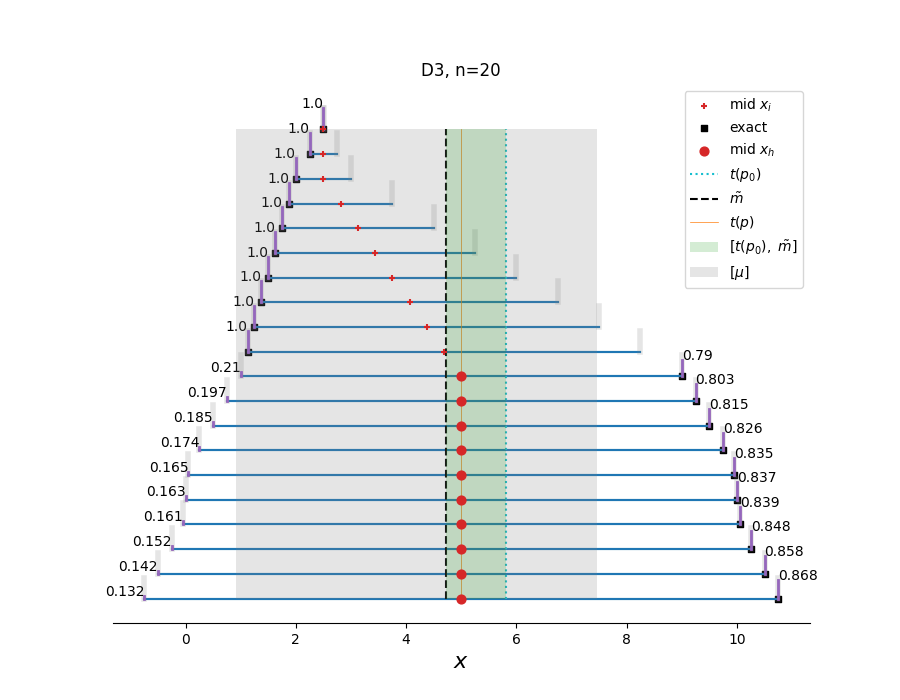

# § 4.3 Examples
## D1 
``` python
import compute
from compute import a

D1  = a([[3.5,6.4], # Puffy data set
         [6.9,8.8],
         [6.1,8.4],
         [2.8,6.7],
         [3.5,9.7],
         [6.5,9.9],
         [0.15,3.8],
         [4.5,4.9],
         [7.1,7.9]])
```


```python
X = D1
compute.full_report_exact(*compute.exact_algorithm_2n(X))
compute.COUNTER_VAR,compute.COUNTER_GRAD,compute.COUNTER_HESS = [],[],[]
'''
------------------------------------------------------------------
-------------------- EXACT ALGORITHM O(2^n) ----------------------
------------------------------------------------------------------
Number of function evaluations v(p): 512
------------------------------------------------------------------
Real valued variance: 10.974444444444444
Corners: ['l' 'r' 'r' 'l' 'r' 'r' 'l' 'l' 'r']
------------------------------------------------------------------
'''
```

```python
X = D1
compute.full_report(X,*compute.fast_algorithm(X,stop=1_000,e=1e-9))
'''
------------------------------------------------------------------
---------------------- POLYNOMIAL ALGORITHM ----------------------
------------------------------------------------------------------
Midponits: [4.95  7.85  7.25  4.75  6.6   8.2   1.975 4.7   7.5  ]
Interval mean: [4.561111111111111, 7.38888888888889]
Width weighted mean: 5.829420432220039
Initial threshold: 6.183333333333334
Initial distribution: [1 0 0 1 0 0 1 1 0]
------------------------------------------------------------------
Number of function evaluations v(p): 1
Number of gradient evaluations g(p): 0
Number of hessian evaluations h(p): 0
------------------------------------------------------------------
Variance at optimum:  10.974444444444442
Optimum distribution: [1 0 0 1 0 0 1 1 0]
Threshold at optimum: 6.183333333333334
Cardinality of H set: 0
Exact upper bound. Dispersive variance must coincide with real valued variance.
Number of gradient iterations: 0
------------------------------------------------------------------
Real valued variance: 10.974444444444444
Corners: ['l' 'r' 'r' 'l' 'r' 'r' 'l' 'l' 'r']
------------------------------------------------------------------
'''
```


## D2
``` python
D2 = a([[1.0, 9.0],
        [1.125, 8.25],
        [1.25, 7.5],
        [1.375, 6.75],
        [1.5, 6.0],
        [1.625, 5.25],
        [1.75, 4.5],
        [1.875, 3.75],
        [2.0, 3.0]   ])
```

 

```python
X = D2
compute.full_report_exact(*compute.exact_algorithm_2n(X))
compute.COUNTER_VAR,compute.COUNTER_GRAD,compute.COUNTER_HESS = [],[],[]
'''
------------------------------------------------------------------
------------------------- EXACT ALGORITHM ------------------------
------------------------------------------------------------------
Number of function evaluations v(p): 512
------------------------------------------------------------------
Real valued variance: 9.725694444444445
Corners: ['r' 'r' 'r' 'l' 'l' 'l' 'l' 'l' 'l']
------------------------------------------------------------------
'''
```

```python
X = D2
compute.full_report(X,*compute.fast_algorithm(X,stop=1_000,e=1e-9))
'''
------------------------------------------------------------------
---------------------- POLYNOMIAL ALGORITHM ----------------------
------------------------------------------------------------------
Midponits: [5.     4.6875 4.375  4.0625 3.75   3.4375 3.125  2.8125 2.5   ]
Interval mean: [1.5, 6.0]
Width weighted mean: 4.155092592592593
Initial threshold: 3.874999999999999
Initial distribution: [0 0 0 1 1 1 1 1 1]
------------------------------------------------------------------
Number of function evaluations v(p): 1
Number of gradient evaluations g(p): 0
Number of hessian evaluations h(p): 0
------------------------------------------------------------------
Variance at optimum:  9.760850694444443
Optimum distribution: [0.         0.         0.         0.68604651 1.         1.
 1.         1.         1.        ]
Threshold at optimum: 4.0625
Cardinality of H set: 1
Number of gradient iterations: 0
------------------------------------------------------------------
Real valued variance: 9.725694444444445
Corners: ['r' 'r' 'r' 'l' 'l' 'l' 'l' 'l' 'l']
------------------------------------------------------------------
'''
```


## D3
``` python
D3 = a([
[-0.75, -0.5, -0.25,  -0.05, 0., 0.05, 0.25, 0.5, 0.75, 1., 1.125, 1.25,  1.375, 1.5, 1.625, 1.75, 1.875, 2., 2.25, 2.495],
[10.75, 10.5, 10.25, 10.05, 10., 9.95, 9.75, 9.5, 9.25, 9., 8.25, 7.5, 6.75, 6., 5.25, 4.5, 3.75, 3., 2.75, 2.505]]).T 

```

 

```python
X = D3
compute.full_report_exact(*compute.exact_algorithm_2n(X))
compute.COUNTER_VAR,compute.COUNTER_GRAD,compute.COUNTER_HESS = [],[],[]
'''
------------------------------------------------------------------
------------------------- EXACT ALGORITHM ------------------------
------------------------------------------------------------------
Number of function evaluations v(p): 1048576
------------------------------------------------------------------
Real valued variance: 17.588838687499994
Corners: ['r' 'r' 'r' 'r' 'r' 'r' 'r' 'r' 'l' 'l' 'l' 'l' 'l' 'l' 
'l' 'l' 'l' 'l' 'l' 'l']
------------------------------------------------------------------
'''
```

```python
X = D3
compute.full_report(X,*compute.fast_algorithm(X,stop=1_000,e=1e-9))
'''
------------------------------------------------------------------
---------------------- POLYNOMIAL ALGORITHM ----------------------
------------------------------------------------------------------
Midponits: [5.     5.     5.     5.     5.     5.     5.     5.     5.     5.
 4.6875 4.375  4.0625 3.75   3.4375 3.125  2.8125 2.5    2.5    2.5   ]
Interval mean: [0.91225, 7.46275]
Width weighted mean: 4.7290760247309365
Initial threshold: 5.8122500000000015
Initial distribution: [0 0 0 0 0 0 0 0 0 0 1 1 1 1 1 1 1 1 1 1]
------------------------------------------------------------------
Number of function evaluations v(p): 2
Number of gradient evaluations g(p): 5
Number of hessian evaluations h(p): 0
------------------------------------------------------------------
Variance at optimum:  17.58894952009362
Optimum distribution: [0.13387076 0.14350216 0.15360598 0.1620382  
0.16419565 0.16637307 0.17528471 0.18688687 0.19901599 0.21168608 
1.         1.         1.         1.         1.         1.         
1.         1.         1.         1.        ]
Threshold at optimum: 4.992807649453763
Cardinality of H set: 10
Number of gradient iterations: 5
------------------------------------------------------------------
Real valued variance: 16.929251187500004
Corners: ['r' 'r' 'r' 'r' 'r' 'r' 'r' 'r' 'r' 'r' 'l' 'l' 'l' 'l' 
'l' 'l' 'l' 'l' 'l' 'l']
------------------------------------------------------------------
'''
```
